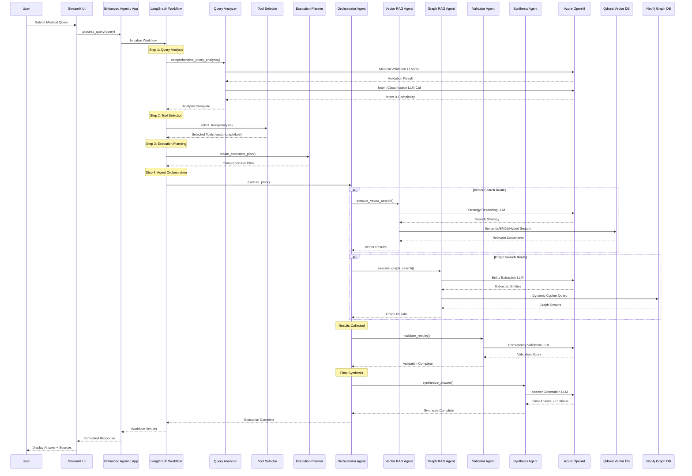
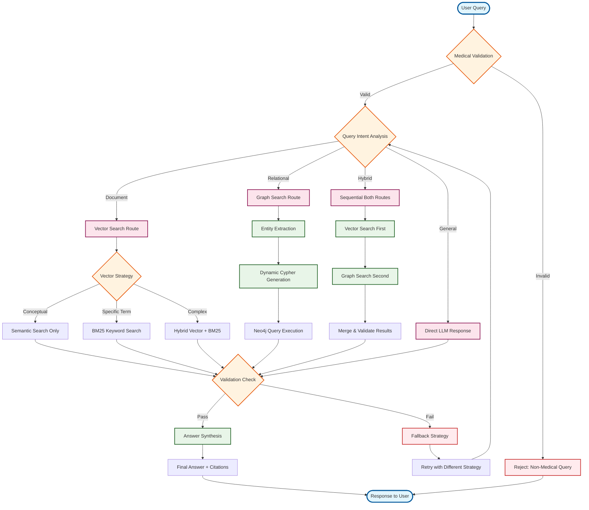
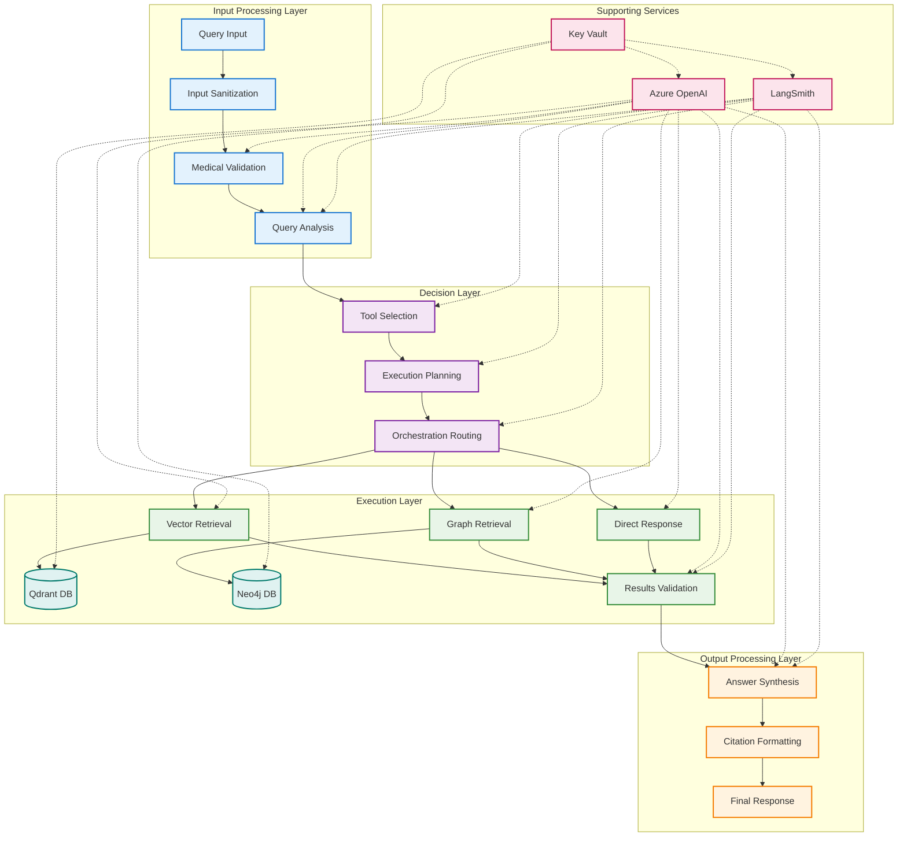
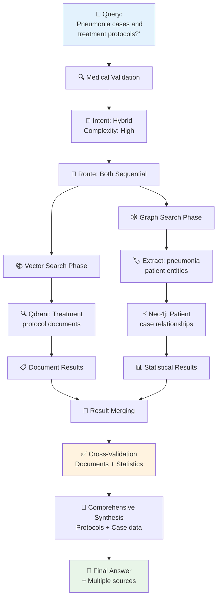
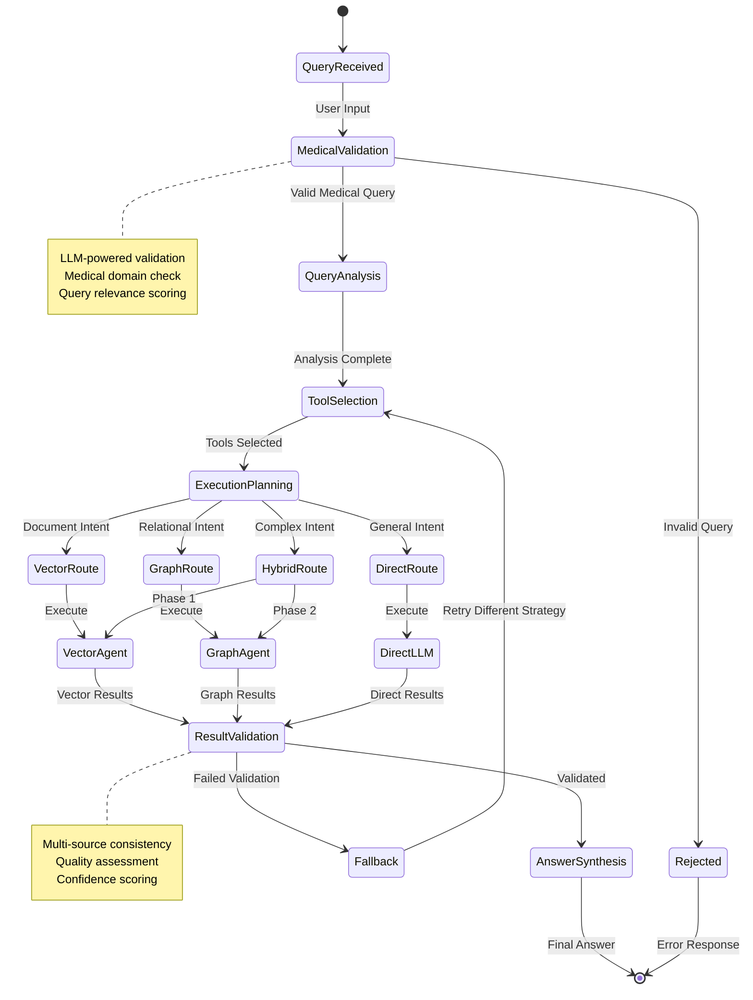
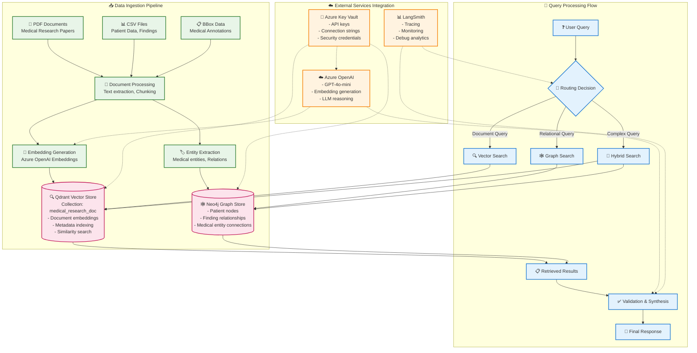
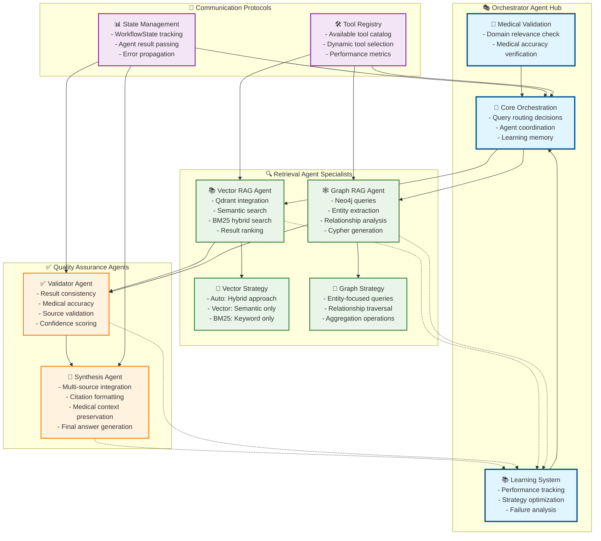

# Enhanced Agentic RAG System - Updated Agents Documentation

## Overview

The Enhanced Agentic RAG System is a sophisticated multi-agent architecture that combines LangGraph workflow orchestration with intelligent reasoning capabilities. This system provides autonomous decision-making for medical document retrieval and analysis using Azure OpenAI, Qdrant vector database, and Neo4j graph database.

## 🏗️ Architecture Overview

### Core Components

```
📁 src/updated_agents/
├── 🤖 simple_agentic_app.py           # Main application orchestrator
├── 🔍 enhanced_query_analyzer.py      # Advanced query analysis
├── 🛠️ dynamic_tool_selector.py        # Intelligent tool selection
├── 📋 execution_planner.py            # Workflow planning engine
├── 🔄 langgraph_agentic_workflow.py   # LangGraph workflow engine
├── 👥 simple_agentic_agents.py        # Multi-agent system
├── 🏗️ base_classes.py                 # Core data structures
├── 🌐 simple_agentic_streamlit.py     # Web interface
└── 💻 working_main.py                 # CLI interface
```

## 📊 System Architecture

### 🏗️ **Complete System Architecture Diagram**

```mermaid
graph TB
    %% User Interface Layer
    subgraph "🌐 User Interface Layer"
        UI[🌐 Streamlit Web Interface<br/>simple_agentic_streamlit.py<br/>- Clean production UI<br/>- Session state management<br/>- Real-time query processing]
        CLI[💻 CLI Interface<br/>working_main.py<br/>- Direct API access<br/>- Testing interface<br/>- Configuration validation]
    end

    %% Security & Configuration Layer
    subgraph "🔐 Security & Configuration Layer"
        KV[🔐 Azure Key Vault<br/>azure_keyvault_manager.py<br/>- Secure secret storage<br/>- Azure CLI authentication<br/>- Environment fallback]
        ENV[📄 Environment Config<br/>.env / .env.dev<br/>- Development settings<br/>- Production overrides<br/>- Key Vault toggles]
        SEC[🛡️ Input Sanitization<br/>input_sanitization.py<br/>- Prompt injection detection<br/>- Input validation<br/>- Output sanitization]
        OBS[📊 Observability<br/>observability.py<br/>- LangSmith integration<br/>- Performance monitoring<br/>- Structured logging]
    end

    %% Core Application Layer
    subgraph "🤖 Core Application Layer"
        APP[🤖 Enhanced Agentic RAG Application<br/>simple_agentic_app.py<br/>- System orchestration<br/>- Component integration<br/>- Health monitoring]
        QA[🔍 Enhanced Query Analyzer<br/>enhanced_query_analyzer.py<br/>- Medical domain validation<br/>- Intent classification<br/>- Complexity assessment]
        TS[🛠️ Dynamic Tool Selector<br/>dynamic_tool_selector.py<br/>- Context-aware selection<br/>- Performance optimization<br/>- Adaptive routing]
        EP[📋 Execution Planner<br/>execution_planner.py<br/>- Step sequencing<br/>- Resource allocation<br/>- Contingency planning]
    end

    %% LangGraph Workflow Engine
    subgraph "🔄 LangGraph Workflow Engine"
        LG[🔄 LangGraph Agentic Workflow<br/>langgraph_agentic_workflow.py<br/>- State-based execution<br/>- Node orchestration<br/>- Conditional routing]
        STATE[📊 Workflow State Management<br/>base_classes.py<br/>- WorkflowState schema<br/>- Agent interfaces<br/>- Data structures]
    end

    %% Multi-Agent System
    subgraph "👥 Multi-Agent System (simple_agentic_agents.py)"
        ORCH[🎭 Agentic Orchestrator Agent<br/>- Medical validation (LLM)<br/>- Query analysis & routing<br/>- Learning memory system<br/>- Performance tracking]
        VRAG[📚 Agentic Vector RAG Agent<br/>- Semantic search (Qdrant)<br/>- Hybrid retrieval strategies<br/>- Adaptive parameter tuning<br/>- Document reranking]
        GRAG[🕸️ Agentic Graph RAG Agent<br/>- Entity extraction<br/>- Dynamic Cypher queries<br/>- Relationship analysis<br/>- Constraint application]
        VAL[✅ Validator Agent<br/>- Result validation<br/>- Consistency checking<br/>- Quality assessment<br/>- Confidence scoring]
        SYN[📝 Answer Synthesis Agent<br/>- Multi-source synthesis<br/>- Citation generation<br/>- Medical context preservation<br/>- Final answer formatting]
    end

    %% External Services & Storage Layer
    subgraph "☁️ External Services & Storage"
        AZURE[☁️ Azure OpenAI<br/>GPT-4o-mini<br/>- LLM reasoning<br/>- Medical validation<br/>- Answer synthesis]
        QDRANT[🔍 Qdrant Vector DB<br/>- Semantic embeddings<br/>- Vector similarity search<br/>- BM25 hybrid search<br/>- Collection: medical_research_doc]
        NEO4J[🕸️ Neo4j Graph DB<br/>- Knowledge graph<br/>- Patient relationships<br/>- Medical entity connections<br/>- Cypher query execution]
        LANGSMITH[📊 LangSmith<br/>- Tracing & debugging<br/>- Performance analytics<br/>- Workflow monitoring<br/>- Error tracking]
    end

    %% Data Processing Pipeline
    subgraph "📥 Data Processing Pipeline"
        INGEST[📥 Document Ingestion<br/>document_ingestion_orchestrator.py<br/>- Medical document processing<br/>- CSV data extraction<br/>- Multi-format support]
        EMBED[🧮 Embeddings Generation<br/>- Vector creation<br/>- Semantic encoding<br/>- Batch processing]
        GRAPH[🔗 Graph Construction<br/>- Entity extraction<br/>- Relationship mapping<br/>- Knowledge graph building]
    end

    %% Connection Flows
    UI --> APP
    CLI --> APP
    
    KV --> APP
    ENV --> KV
    SEC --> APP
    OBS --> APP
    OBS --> LANGSMITH
    
    APP --> QA
    APP --> TS
    APP --> EP
    APP --> LG
    
    LG --> STATE
    LG --> ORCH
    
    ORCH --> VRAG
    ORCH --> GRAG
    VRAG --> VAL
    GRAG --> VAL
    VAL --> SYN
    
    VRAG --> QDRANT
    GRAG --> NEO4J
    ORCH --> AZURE
    VAL --> AZURE
    SYN --> AZURE
    
    INGEST --> EMBED
    INGEST --> GRAPH
    EMBED --> QDRANT
    GRAPH --> NEO4J

    %% Styling
    classDef userLayer fill:#e1f5fe,stroke:#01579b,stroke-width:2px
    classDef securityLayer fill:#f3e5f5,stroke:#4a148c,stroke-width:2px
    classDef coreLayer fill:#e8f5e8,stroke:#1b5e20,stroke-width:2px
    classDef workflowLayer fill:#fff3e0,stroke:#e65100,stroke-width:2px
    classDef agentLayer fill:#fce4ec,stroke:#880e4f,stroke-width:2px
    classDef storageLayer fill:#e0f2f1,stroke:#00695c,stroke-width:2px
    classDef dataLayer fill:#f1f8e9,stroke:#33691e,stroke-width:2px

    class UI,CLI userLayer
    class KV,ENV,SEC,OBS securityLayer
    class APP,QA,TS,EP coreLayer
    class LG,STATE workflowLayer
    class ORCH,VRAG,GRAG,VAL,SYN agentLayer
    class AZURE,QDRANT,NEO4J,LANGSMITH storageLayer
    class INGEST,EMBED,GRAPH dataLayer
```

### 🔄 **Agent Interaction Flow Diagram**



### 🧠 **Agent Decision Tree Diagram**



### 🏗️ **Component Interaction Matrix**



### 1. **Enhanced Agentic RAG Application** (`simple_agentic_app.py`)

**Purpose**: Main application orchestrator that coordinates all components

**Key Features**:
- System initialization and health monitoring
- Component integration and dependency management
- Configuration management (Azure Key Vault integration)
- Error handling and recovery mechanisms

**Main Methods**:
```python
class EnhancedAgenticRAGApplication:
    def initialize_system() -> Dict[str, Any]
    def process_query(query: str) -> Dict[str, Any]
    def get_system_status() -> Dict[str, Any]
```

**Initialization Flow**:
1. Load configuration from Azure Key Vault or environment
2. Initialize Azure OpenAI LLM components
3. Set up vector and graph database connections
4. Initialize all agent components
5. Validate system readiness

### 2. **Enhanced Query Analyzer** (`enhanced_query_analyzer.py`)

**Purpose**: Advanced query understanding and classification

**Key Capabilities**:
- **Medical Domain Validation**: Ensures queries are medically relevant
- **Intent Detection**: Classifies queries as document, relational, or hybrid
- **Complexity Assessment**: Evaluates query complexity for routing decisions
- **Entity Recognition**: Identifies medical entities and relationships

**Analysis Pipeline**:
```python
def comprehensive_query_analysis(query: str) -> AnalysisResult:
    # 1. Medical relevance validation
    # 2. Intent classification (document/relational/hybrid)
    # 3. Complexity scoring
    # 4. Entity extraction
    # 5. Confidence assessment
```

**Query Classification Examples**:
- **Document Intent**: "What is NIH Chest X-ray?" → Vector search
- **Relational Intent**: "Total male patients age 17 with effusion?" → Graph search
- **Hybrid Intent**: "Pneumonia cases and treatment protocols?" → Both search types

### 3. **Dynamic Tool Selector** (`dynamic_tool_selector.py`)

**Purpose**: Intelligent selection of retrieval tools based on query analysis

**Selection Strategy**:
- **Vector Search**: For conceptual queries and document retrieval
- **Graph Search**: For relational queries with specific entity relationships  
- **Hybrid Search**: For complex queries requiring both approaches
- **No Retrieval**: For general medical knowledge queries

**Tool Selection Logic**:
```python
def select_tools(analysis: AnalysisResult) -> List[str]:
    if analysis.intent == "relational" and analysis.has_relationships:
        return ["graph_search"]
    elif analysis.intent == "document":
        return ["vector_search"]
    elif analysis.complexity == "high":
        return ["vector_search", "graph_search"]
    else:
        return ["vector_search"]
```

### 4. **Execution Planner** (`execution_planner.py`)

**Purpose**: Creates comprehensive execution plans with contingencies

**Planning Features**:
- **Step Sequencing**: Optimizes execution order for efficiency
- **Resource Allocation**: Manages computational resources
- **Contingency Planning**: Provides fallback strategies
- **Performance Estimation**: Predicts execution time and resource usage

**Plan Structure**:
```python
class ExecutionPlan:
    plan_id: str
    steps: List[ExecutionStep]
    contingencies: List[ContingencyPlan]
    estimated_duration: str
    resource_requirements: Dict[str, Any]
```

### 5. **LangGraph Agentic Workflow** (`langgraph_agentic_workflow.py`)

**Purpose**: State-based workflow orchestration using LangGraph

**Workflow Nodes**:
- **Query Analysis**: Enhanced query understanding
- **Tool Selection**: Dynamic tool selection
- **Execution Planning**: Comprehensive plan creation
- **Agent Orchestration**: Multi-agent execution
- **Validation**: Result validation and quality checks
- **Synthesis**: Final answer generation

**State Management**:
```python
class WorkflowState:
    query: str
    analysis_result: AnalysisResult
    selected_tools: List[str]
    execution_plan: ExecutionPlan
    agent_results: Dict[str, Any]
    validation_result: ValidationResult
    final_answer: str
```

## 👥 Multi-Agent System (`simple_agentic_agents.py`)

### Agent Architecture

The system employs five specialized agents, each with distinct responsibilities:

### 1. **Agentic Orchestrator Agent**

**Role**: Central coordinator and decision maker

**Capabilities**:
- **Medical Validation**: LLM-powered validation of medical query relevance
- **Query Analysis**: Deep understanding of query intent and complexity
- **Route Decisions**: Intelligent routing to appropriate specialist agents
- **Learning Memory**: Continuous learning from past interactions

**Key Methods**:
```python
def enhanced_reasoning(query: str) -> Dict[str, Any]
def medical_validation_tool(query: str) -> Dict[str, Any]
def analyze_query_characteristics_tool(query: str) -> Dict[str, Any]
```

### 2. **Agentic Vector RAG Agent**

**Role**: Semantic document retrieval specialist

**Advanced Features**:
- **Adaptive Search Strategy**: Automatically selects optimal search approach
  - `auto`: Hybrid vector + BM25
  - `vector_only`: Pure semantic search
  - `bm25_only`: Keyword-based search
- **Dynamic Parameter Tuning**: Adjusts search parameters based on query type
- **Result Reranking**: LLM-powered relevance scoring
- **Learning Integration**: Improves search strategy based on success patterns

**Search Strategies**:
```python
# Strategy Selection Logic
if query_type == "conceptual":
    strategy = "vector_only"
elif query_type == "specific_term":
    strategy = "bm25_only"
else:
    strategy = "auto"  # Hybrid approach
```

**Performance Metrics**:
- Success rate tracking per strategy
- Average relevance scoring
- Response time optimization

### 3. **Agentic Graph RAG Agent**

**Role**: Knowledge graph navigation specialist

**Graph Operations**:
- **Entity Extraction**: Identifies medical entities from queries
- **Dynamic Cypher Generation**: Creates optimized Neo4j queries
- **Relationship Analysis**: Discovers entity relationships and patterns
- **Constraint Application**: Applies filters and constraints intelligently

**Query Examples**:
```cypher
// Patient demographic queries
MATCH (p:Patient {age: 17, gender: 'Male'})
WHERE p.finding_labels CONTAINS 'effusion'
RETURN COUNT(p)

// Disease correlation analysis
MATCH (p:Patient)-[:HAS_FINDING]->(f:Finding)
WHERE f.name = 'pneumonia'
RETURN p.age_group, COUNT(p) as case_count
```

### 4. **Validator Agent**

**Role**: Quality assurance and consistency checking

**Validation Dimensions**:
- **Content Accuracy**: Verifies factual correctness
- **Source Consistency**: Checks consistency across multiple sources
- **Medical Validity**: Ensures medically sound information
- **Completeness**: Assesses answer completeness

**Validation Process**:
```python
def validate_results(results: Dict[str, Any]) -> ValidationResult:
    # 1. Check document count and quality
    # 2. Assess content relevance
    # 3. Verify medical accuracy
    # 4. Calculate confidence scores
```

### 5. **Answer Synthesis Agent**

**Role**: Final answer generation and presentation

**Synthesis Features**:
- **Multi-Source Integration**: Combines vector and graph results seamlessly
- **Citation Management**: Tracks and formats source citations
- **Confidence Scoring**: Provides transparency in answer confidence
- **Medical Context**: Maintains medical accuracy and appropriate terminology

**Synthesis Pipeline**:
```python
def enhanced_synthesis(context: str, query: str) -> Dict[str, Any]:
    # 1. Analyze context relevance
    # 2. Generate comprehensive answer
    # 3. Add appropriate citations
    # 4. Calculate confidence score
```

## 🔄 Workflow Execution Patterns

### **Pattern 1: Document Retrieval Flow (Vector Search)**

```mermaid
graph LR
    A[📝 Query:<br/>'What is NIH Chest X-ray?'] --> B[🔍 Medical Validation<br/>LLM Check]
    B --> C[📊 Intent: Document<br/>Complexity: Simple]
    C --> D[🎯 Route: Vector Only]
    D --> E[🧠 Strategy Selection<br/>BM25 for specific terms]
    E --> F[🔍 Qdrant Search<br/>medical_research_doc]
    F --> G[📋 5 Documents Retrieved<br/>Relevance > 0.6]
    G --> H[✅ Validation<br/>Score: 0.8]
    H --> I[📝 Synthesis<br/>Confidence: 0.95]
    I --> J[📄 Final Answer<br/>+ Citations]
    
    style A fill:#e3f2fd
    style J fill:#e8f5e8
    style H fill:#fff3e0
```


### **Pattern 2: Relational Query Flow (Graph Search)**
```mermaid
graph LR
    A[📊 Query:<br/>'Male patients age 17<br/>with effusion?'] --> B[🔍 Medical Validation<br/>LLM Check]
    B --> C[📈 Intent: Relational<br/>Complexity: Moderate]
    C --> D[🎯 Route: Graph Only]
    D --> E[🏷️ Entity Extraction<br/>age=17, gender=Male<br/>finding=effusion]
    E --> F[⚡ Cypher Generation<br/>MATCH (p:Patient)<br/>WHERE conditions]
    F --> G[🕸️ Neo4j Query<br/>Patient relationships]
    G --> H[📊 Count Results<br/>Aggregated data]
    H --> I[✅ Validation<br/>Data consistency]
    I --> J[📝 Synthesis<br/>Statistical summary]
    J --> K[📄 Final Answer<br/>+ Data sources]
    
    style A fill:#e3f2fd
    style K fill:#e8f5e8
    style I fill:#fff3e0
```

### **Pattern 3: Hybrid Execution Flow (Sequential Both)**


### **Pattern 4: Direct LLM Response Flow (No Retrieval)**

```mermaid
graph LR
    A[❓ Query:<br/>'What is medical imaging?'] --> B[🔍 Medical Validation<br/>LLM Check]
    B --> C[🧠 Intent: General<br/>Knowledge available]
    C --> D[🎯 Route: Direct LLM]
    D --> E[🤖 Azure OpenAI<br/>Direct reasoning]
    E --> F[✅ Validation<br/>Medical accuracy]
    F --> G[📝 Synthesis<br/>General knowledge]
    G --> H[📄 Final Answer<br/>No external sources]
    
    style A fill:#e3f2fd
    style H fill:#e8f5e8
    style F fill:#fff3e0
```


### **Advanced Multi-Agent Coordination Flow**


### **🗂️ Data Architecture & Storage Flow**



### **🏗️ Agent Collaboration Architecture**



## 🛡️ Security & Configuration

### Azure Key Vault Integration

**Secure Secret Management**:
```python
# Configuration retrieval
azure_endpoint = get_secret_from_keyvault("AZURE-OPENAI-ENDPOINT")
azure_api_key = get_secret_from_keyvault("AZURE-OPENAI-API-KEY")
qdrant_url = get_secret_from_keyvault("QDRANT-API-URL")
neo4j_uri = get_secret_from_keyvault("NEO4J-URI")
```

**Environment Configuration**:
- **Production**: Uses Azure Key Vault for all secrets
- **Development**: Falls back to `.env.dev` for local development
- **Testing**: Supports mock configurations for unit testing

### Input Sanitization

**Security Measures**:
- Prompt injection detection
- Input length validation
- Medical domain validation
- Output sanitization

## 📊 Performance & Monitoring

### Learning Memory System

**Adaptive Intelligence**:
- **Query Pattern Learning**: Improves routing decisions over time
- **Search Strategy Optimization**: Adapts search parameters based on success
- **Performance Tracking**: Monitors response times and accuracy
- **Failure Analysis**: Learns from failed queries to improve robustness

### Observability Features

**Monitoring Capabilities**:
- **LangSmith Integration**: Detailed tracing and debugging
- **Structured Logging**: Comprehensive activity logging
- **Performance Metrics**: Response time and accuracy tracking
- **Health Monitoring**: System component status tracking

## 🚀 Usage Examples

### Basic Query Processing

```python
from updated_agents.simple_agentic_app import EnhancedAgenticRAGApplication

# Initialize application
app = EnhancedAgenticRAGApplication()
result = app.initialize_system()

# Process query
query = "What is NIH Chest X-ray?"
response = app.process_query(query)

print(response['final_answer'])
```

### Advanced Configuration

```python
# Custom configuration with Key Vault
import os
os.environ['Keyvalue_Enabled'] = 'true'

# Initialize with specific parameters
app = EnhancedAgenticRAGApplication()
app.initialize_system()

# Process complex relational query
query = "Total number of male patients aged 17 with effusion?"
response = app.process_query(query)
```

### Streamlit Web Interface

```python
# Run the web interface
streamlit run src/updated_agents/simple_agentic_streamlit.py

# Access at: http://localhost:8501
```

## 🔧 Configuration

### Required Environment Variables

**Azure OpenAI Configuration**:
```env
AZURE-OPENAI-ENDPOINT=https://your-openai.openai.azure.com/
AZURE-OPENAI-API-KEY=your-api-key
AZURE-OPENAI-DEPLOYMENT=gpt-4o-mini
AZURE-OPENAI-API-VERSION=2024-02-15-preview
```

**Vector Database Configuration**:
```env
QDRANT-API-URL=https://your-cluster.qdrant.io:6333
QDRANT-API-KEY-VAL=your-qdrant-api-key
QDRANT-COLLECTION=medical_research_doc
```

**Graph Database Configuration**:
```env
NEO4J-URI=bolt://localhost:7687
NEO4J-USERNAME=neo4j
NEO4J-PASSWORD=your-password
```

### Azure Key Vault Setup

1. Create Azure Key Vault resource
2. Add secrets with exact names matching environment variables
3. Configure Azure CLI authentication
4. Set `Keyvalue_Enabled=true` in environment

## 🎯 Key Benefits

### 1. **True Agentic Behavior**
- Each agent has autonomous reasoning capabilities
- Learning memory system for continuous improvement
- Adaptive decision-making based on context

### 2. **Production-Ready Architecture**
- Comprehensive error handling and recovery
- Security-first design with input sanitization
- Scalable component architecture

### 3. **Multi-Modal Intelligence**
- Vector search for semantic understanding
- Graph search for relational queries
- Hybrid approaches for complex scenarios

### 4. **Medical Domain Expertise**
- Specialized medical validation
- Domain-specific entity recognition
- Medically accurate response generation

### 5. **Enterprise Integration**
- Azure Key Vault for secure credential management
- LangSmith for observability and debugging
- Streamlit for user-friendly interface

## 🔮 Future Enhancements

### Planned Features
- **Multi-Language Support**: Extend to non-English medical queries
- **Advanced Reasoning**: Integration with reasoning frameworks
- **Custom Agent Development**: Framework for domain-specific agents
- **Advanced Analytics**: Enhanced performance analytics and insights
- **Federated Learning**: Distributed learning across deployments

### Extensibility Points
- **New Agent Types**: Easy addition of specialized agents
- **Additional Databases**: Support for additional vector/graph databases
- **Custom Tools**: Framework for custom tool development
- **Workflow Customization**: Flexible workflow modification capabilities

---

## 📚 Related Documentation

- [Architecture Overview](architecture.md)
- [Installation Guide](../README.md)
- [API Reference](api_reference.md)
- [Deployment Guide](deployment.md)

---

**Version**: 1.0.0  
**Last Updated**: August 21, 2025  
**Author**: Enhanced Agentic RAG Development Team
